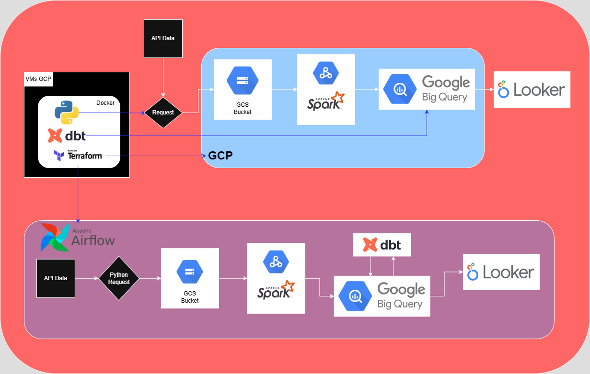
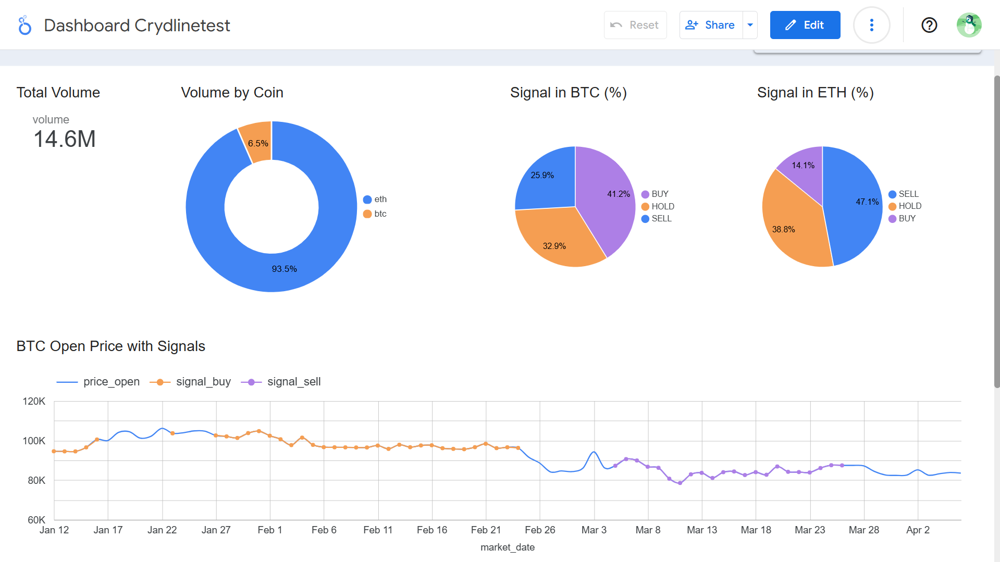

# Crydlinetest: Crypto Data Pipeline test


## About
Crydlinetest is a crypto data pipeline project that demonstrates a complete data engineering workflow for cryptocurrency analysis.
This pipeline retrieves historical crypto data from the [Alpha Vantage API], processes it, stores it, and visualizes it in a dashboard. The main goal is to create a scalable and cloud-based data pipeline that transforms raw crypto data into actionable insights.


## Technologies Used
- Cloud Provider: Google Cloud Platform (GCP)
- Infrastructure as Code: Terraform
- Containerization: Docker (Python, Terraform, dbt)
- Workflow Orchestration: Apache Airflow (via Cloud Composer)
- Data Ingestion: Python (requests, GCloud SDK)
- Storage: Google Cloud Storage (GCS)
- Batch Processing: Apache Spark (Dataproc)
- Transformation: dbt
- Data Warehouse: BigQuery
- Dashboard: Looker Studio


## Deployment
The entire data pipeline was initially developed on a GCP Virtual Machine (VM) located in the asia-southeast1-a region using Ubuntu as the base operating system.
After development and testing, the pipeline was deployed to Cloud Composer, a managed Apache Airflow environment on GCP, to orchestrate and run the data workflows in production.


## Project Flow




## Dashboard



You can view the dashboard here:
👉 [Open Crydlinetest Dashboard on Looker Studio](https://lookerstudio.google.com/reporting/359e607f-726d-4b94-9bc6-9c16d07b1cd4)


## Prerequisites

- ✅ Google Cloud Platform account
- ✅ Existing GCP Project (with Project ID)
- ✅ API Key from [Alpha Vantage](https://www.alphavantage.co/support/#api-key)


## 🛠️ How to Run This Project

### File setup for cloud

Run it in cloud shell.
```bash
nano setup_cloud.sh
```
Fill it with codes in script setup_cloud.sh (~/setup_cloud.sh), then save it.
```bash
chmod +x setup_cloud.sh
./setup_cloud.sh
```
After you run setup_cloud.sh, there is service-account-key.json in your VMs user home.
Move it to folder ~/auth and ~/airflow/auth.

### Setup SSH key in Client  (optional)

It's optional, but I prefer to used it.
Create SSH Key in your local terminal:
```bash
ssh-keygen -t rsa -f $HOME\.ssh\yourprojectid_key -C sshuser
```
Get your code from yourprojectid_key.pub:
```bash
cat ~/.ssh/crydlinetest_key.pub
```
Then put it to SSH Keys in GCP:
https://console.cloud.google.com/compute/metadata?organizationId=0&project=[yourprojectid]&scopeTab=projectMetadata&resourceTab=sshkeys

### Install Docker

Make sure, you read and edit docker-compose.yml as your conditions.
VMs GCP terminal, in main directory project:
```bash
chmod +x install_docker_makefile.sh
./install_docker_makefile.sh
```
After finished, you can logout then login, or run:
```bash
exec su -l $USER
```

### Setup Terraform, Python, and dbt in Docker

VMs GCP terminal, in main directory project:
```bash
docker compose build
docker compose up -d
```

### Run terraform

Make sure, you read and edit variables.tf, main.tf, and outputs.tf as your conditions.
VMs GCP terminal, in main directory project:
```bash
make tf-init
make tf-fmt
make tf-plan
make tf-apply
```
With this step, you has created Bucket, Dataset, Apache Spark, and Apache Airflow.

### Ingest Raw Data to Bucket:

Make sure, you read and edit scripts ingest_indicator.py and ingest_coin.py as your conditions.
VMs GCP terminal, in main directory project:
```bash
make ingest-indicator
make ingest-coin
```
Try to do data analysis from raw data.

### Transform data spark (bucket to bigquery):

Make sure, you read and edit run_spark.sh and spark_job.py as your conditions.
VMs GCP terminal, in main directory project:
```bash
cd /spark/
chmod +x run_spark.sh
./run_spark.sh
```

### Transrom dbt (in bigquery):

Make sure, you read and edit profiles.yml, dbt_project.yml, schema.yml, and models as your conditions.
VMs GCP terminal, in main directory project:
```bash
make dbt-debug
make dbt-run
```

### Deploy to Airflow

Make sure, you read and edit upload_bucket_composer.sh as your conditions.
I have created your_dag.py as dag script and copy all files needed to folder ~/airflow.
Please check again, and edit variables as your conditions before run upload_bucket_composer.sh.
VMs GCP terminal, in main directory project:
```bash
cd /airflow/
chmod +x upload_bucket_composer.sh
./upload_bucket_composer.sh
```

After upload all to composer bucket, I suggest you to check your 'PyPI packages' in Environment Composer (https://console.cloud.google.com/composer). Ensure requirement.txt updated. After updated, you can wait 10 minutes then start your dag from UI airflow.